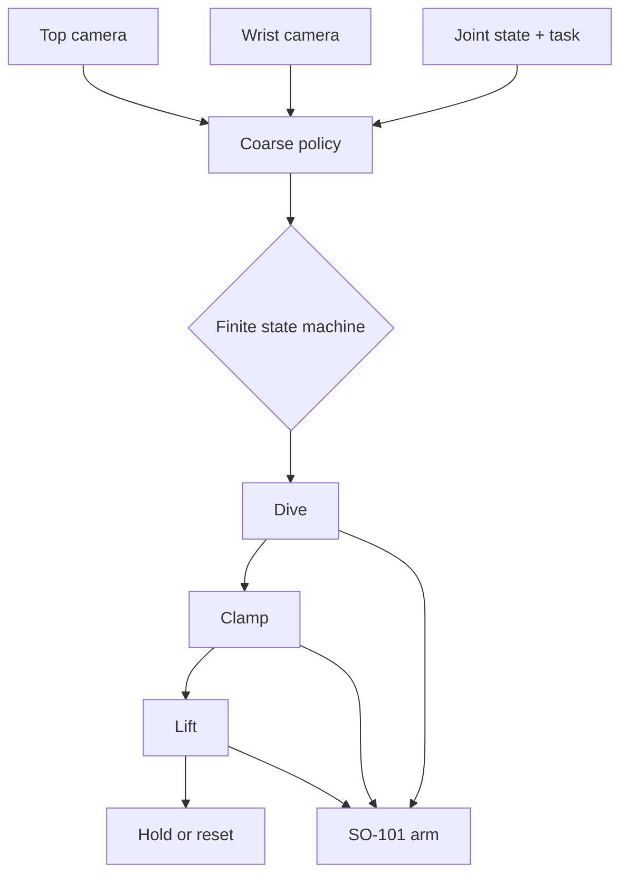

# SO-101 Pick

General-purpose pick-up with an [SO-101](https://huggingface.co/docs/lerobot/so101) arm. [MolmoAct-2](https://huggingface.co/docs/lerobot/main/en/molmoact2) handles the coarse approach, then a finite state machine runs taught action primitives for the grasp.

Use this to approach an object, commit to a grasp, and lift and hold it.

## Getting started

You need: macOS, conda env `lerobot` ([LeRobot install](https://huggingface.co/docs/lerobot/installation)), local `models/molmoact2-mps` weights (untracked, prepared with `scripts/prepare_molmo_mps.py`), SO-101 follower (`my_awesome_follower_arm`), two USB cameras. The USB port name varies by machine.

1. Connect the arm and cameras. Confirm the port and update `--robot.port` in `scripts/run_molmo.sh` if it differs:

```bash
ls /dev/tty.usbmodem*
```

2. Verify cameras (cam0 top, cam1 wrist):

```bash
conda activate lerobot
python scripts/preview_cameras.py
```

3. Run a session:

```bash
bash scripts/run_molmo.sh
```

4. Teach a new grasp pose when the object moves. Torque is off, so support the arm. Save to the default path, or set `COMMIT_GRASP` if you save elsewhere:

```bash
python scripts/teach_waypoints_by_hand.py --out outputs/waypoints/tape_grasp.json
python scripts/commit_primitives.py --dry-run
```

## Architecture

Hybrid coarse-to-fine control architecture, typically implemented via a finite state machine that utilizes action primitives for the final execution.

MolmoAct-2 runs on a timer (15 seconds by default), not a position trigger, then control passes to blind joint primitives. This bypasses the approach-retreat oscillation where descent confidence drops near contact and the policy retreats to a familiar observation instead of initiating the grasp.



Finite state machine states:

1. Coarse: MolmoAct-2, 15 seconds by default.
2. Dive: slow move to taught lowered pose.
3. Clamp: full close with settle and re-squeeze.
4. Lift: slow lift with micro re-squeeze.
5. Hold or reset.

Primitives come from `outputs/waypoints/tape_grasp.json` (override with `COMMIT_GRASP`). Defaults: `COMMIT_SECONDS=15`, `COMMIT_CLOSED=0.0`, `COMMIT_DIVE_STEP_DEG=0.4`, `COMMIT_DIVE_FPS=15`. Degrees mode, max relative target 10, observed about 13 Hz on Apple Metal Performance Shaders.

## Usage

Run a session, then type commands in the session prompt. Change the task with `--task` in `scripts/run_molmo.sh`:

```bash
bash scripts/run_molmo.sh
```

| Command | Description |
|---|---|
| `/commit` | Coarse 15 seconds, then dive, clamp, lift, hold. |
| `/commit 20` | Same with 20 seconds of coarse. |
| `/commit reset` | Same, then return to start. |
| `/commitandrecord` | Same as `/commit` plus saves top and wrist video to `outputs/commit_records/<timestamp>/` (covers coarse plus primitives plus 5 s hold, so longer than 15 s). |
| `/reset` | Return to start. |
| `/stop` | Shut down. Torque turns off, so support the arm. |
