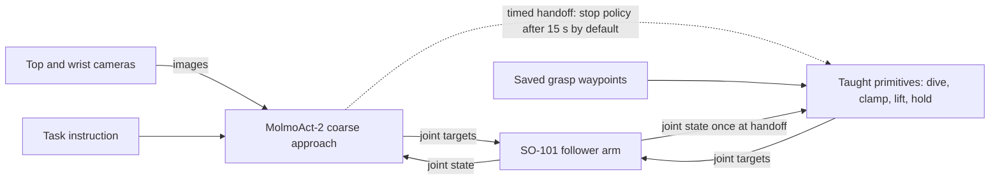

# SO-101 Pick

Object pick-up with an [SO-101](https://huggingface.co/docs/lerobot/so101) arm. [MolmoAct-2](https://huggingface.co/docs/lerobot/main/en/molmoact2) handles the coarse approach, then a finite state machine runs taught action primitives for the grasp.

Use this to approach an object, commit to a grasp, and lift and hold it.


## Getting started

You need: macOS, conda env `lerobot` ([LeRobot install](https://huggingface.co/docs/lerobot/installation)), local `models/molmoact2-mps` weights (untracked, prepared with `scripts/prepare_molmo_mps.py`), SO-101 follower (`my_awesome_follower_arm`), two USB cameras. The USB port name varies by machine.

1. Connect the arm and cameras. Confirm the port and update `--robot.port` in `scripts/run_molmo.sh` if it differs:

```bash
ls /dev/tty.usbmodem*
```

2. Verify cameras (cam0 top, cam1 wrist):

```bash
conda activate lerobot
python scripts/preview_cameras.py
```

3. Teach grasp waypoints before the first commit, and repeat when the object or arm base moves. Close the camera preview and stop any rollout before teaching. Torque is disabled during teaching, so support the arm:

```bash
python scripts/teach_waypoints_by_hand.py --out outputs/waypoints/tape_grasp.json
python scripts/commit_primitives.py --dry-run
```

If your arm uses a different port, pass `--port` to the teaching script. For a different waypoint file, pass `--grasp` to the dry run and set `COMMIT_GRASP` when launching the session. The final grasp follows these taught poses, so it requires a repeatable object position.

4. Run a session:

```bash
bash scripts/run_molmo.sh
```

## Architecture

Hybrid coarse-to-fine control: MolmoAct-2 approaches for a fixed duration (15 seconds by default). When the timer expires, the policy stops and a finite state machine executes taught joint-space primitives for the dive, clamp, and lift. The handoff is timer-based, not triggered by detecting the object's position or contact. The primitive sequence reads the measured joint positions once at the handoff. It then interpolates toward each taught pose, using the previous target as the next starting point. Stage transitions depend on completing the commanded steps and settling pauses; visual or contact feedback does not determine grasp success.



Solid arrows show data and commands. The dashed arrow shows the transition between controllers. The arm receives commands during both phases. The optional return to the starting pose follows the sequence below.

Commit sequence:

1. Coarse approach: MolmoAct-2 runs for 15 seconds by default.
2. Dive: slow move to the taught lowered pose.
3. Clamp: close fully, settle, then re-squeeze.
4. Lift: slow move to the taught lift pose.
5. Hold position. Run `/reset` separately to return to the start; `/commit reset` runs the sequence and then returns.

Primitives come from `outputs/waypoints/tape_grasp.json` (override with `COMMIT_GRASP`). Defaults: `COMMIT_SECONDS=15`, `COMMIT_CLOSED=0.0`, `COMMIT_DIVE_STEP_DEG=0.4`, `COMMIT_DIVE_FPS=15`. Degrees mode, max relative target 10, observed about 13 Hz on Apple Metal Performance Shaders.

## Usage

Run a session, then type commands in the session prompt. Change the task with `--task` in `scripts/run_molmo.sh`:

```bash
bash scripts/run_molmo.sh
```

| Command | Description |
|---|---|
| `/commit` | Coarse 15 seconds, then dive, clamp, lift, hold. |
| `/commit 20` | Same with 20 seconds of coarse. |
| `/commit reset` | Same, then return to start. |
| `/commitandrecord` | Same as `/commit` plus saves top and wrist video to `outputs/commit_records/<timestamp>/` (covers coarse plus primitives plus 5 s hold, so longer than 15 s). |
| `/reset` | Return to start. |
| `/stop` | Shut down. Torque turns off, so support the arm. |
